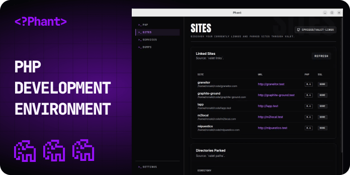

# Phant

  

Phant is a Linux desktop app for local PHP development.

It helps you inspect and manage the parts of your local workflow that are usually spread across terminal commands, PHP config files, Valet Linux, and service status checks.

## Current Support

- Linux desktop environments are the current supported and documented target.
- macOS is not currently documented as a supported packaged runtime.

## What Phant Does

Phant currently focuses on these workflows:

- **Dump capture**: Monitor `dump()` and `dd()` output in real time from CLI workflows and Valet-backed HTTP requests when hooks are configured.
- **PHP management**: Install and switch PHP versions, update selected `php.ini` values, and toggle extensions.
- **Sites and Valet**: Inspect linked sites and parked directories, then verify and remediate Valet Linux and PHP-FPM wiring.
- **Services status**: Check the current status of common local development services such as PostgreSQL, MySQL, MariaDB, Redis, Valkey, and Mailpit.
- **Settings and updates**: Manage license key, diagnostics, updates, and app appearance from one place.

Phant is built for developers who want a more visible and manageable local PHP setup without constantly switching between multiple tools.

## Get Started

- User documentation: https://phant-app.github.io/
- Official Linux build: https://payhip.com/b/ygTYq
- Source code: https://github.com/phant-app/phant

## Issues

Found a bug or have a feature request? Please [open an issue](https://github.com/phant-app/phant/issues) on GitHub. Include as much detail as possible (OS, Phant version, steps to reproduce, logs if available).

## Contribution

Contributions are welcome! To get started:

1. Fork this repository and create a feature branch.
2. Follow the [CONTRIBUTING guidelines](CONTRIBUTING.md) (if available).
3. Submit a pull request with a clear description of your changes.

We recommend opening an issue to discuss major features or changes before submitting a PR.

## Support

- For help, check the [documentation](https://phant-app.github.io/) and [GitHub Discussions](https://github.com/phant-app/phant/discussions).
- For bugs and reproducible problems, open an [issue](https://github.com/phant-app/phant/issues).

## Credits

Phant would not be possible without the open source community. Special thanks to:

- [cpriego/valet-linux](https://github.com/cpriego/valet-linux) – inspiration and reference for Linux Valet functionality
- [wailsapp/wails](https://github.com/wailsapp/wails) – cross-platform desktop app framework
- All contributors and maintainers of the PHP, Laravel, and open source ecosystem

## License

Phant is licensed under the [Business Source License 1.1](LICENSE.md).

- Phant is source-available under BSL 1.1.
- The current Additional Use Grant allows non-commercial use, use by individuals, use by companies with fewer than 100 employees, and internal testing/development use.
- The license converts to MIT on the Change Date defined in `LICENSE.md`.
- Official Linux build: https://payhip.com/b/ygTYq

See `LICENSE.md` for the exact terms.

